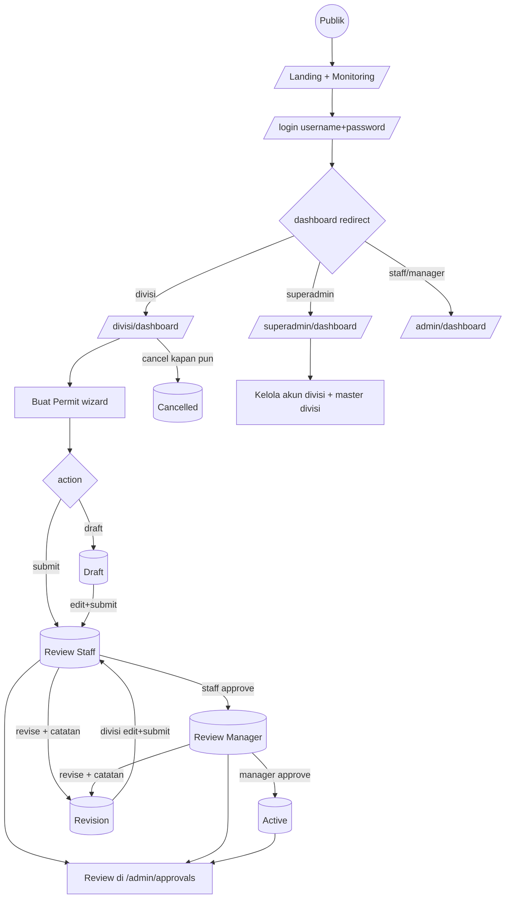

# SIMONIKA Madiun
## Sistem Informasi Monitoring & Izin Kerja — PT INKA Madiun

**Bedah Kode: fungsi tiap bagian + User Flow**
Stack: Laravel 13 • PHP 8.3 • Blade • Tailwind v3 • Alpine.js • MySQL (dev) / SQLite (test) • DomPDF

> Cara pakai sebagai PPT: buka file ini di VS Code + extension **Marp for VS Code**, atau import ke Slidev / Marpit. Tiap `---` = 1 slide. Diagram Mermaid bisa dirender di GitHub / Marp + plugin mermaid.

---

## Agenda Presentasi

1. Gambaran sistem & peran pengguna
2. Tech stack & struktur folder
3. Auth, role, middleware
4. Database & Model
5. Logika inti: `no_permit`, tanda tangan, dokumen, PDF
6. Routes & Controller per role
7. Status permit & alur approval
8. **User Flow** per role (publik → divisi → staff → manager → superadmin)
9. Views / UI per role + wizard 7 langkah
10. Keamanan & cara menjalankan

---

## 1. Gambaran Sistem — Untuk Apa Aplikasi Ini?

Digitalisasi **pengajuan + verifikasi berlapis izin kerja risiko tinggi** kontraktor di PT INKA Madiun.

- **Divisi** mengajukan permit (klasifikasi, pekerja, peralatan, bahaya, pencegahan, APD, dokumen, tanda tangan).
- **Staff → Manager HSE** mereview berurutan sampai `Active`.
- **Superadmin** hanya mengelola akun divisi + master divisi.
- **Publik** (tanpa login) melihat landing + tabel monitoring permit non-Draft.
- Seluruh teks UI **Bahasa Indonesia**.

---

## 2. Tech Stack

| Lapisan | Teknologi / File bukti |
|---|---|
| Backend | Laravel 13 (`composer.json`), PHP `^8.3` |
| Auth starter | `laravel/breeze ^2.4` (dikustom login username) |
| Frontend | Blade + Tailwind CSS v3 (`tailwind.config.js`) + Alpine.js (`x-data` modal/dropdown) |
| PDF | `barryvdh/laravel-dompdf ^3.1`, view `divisi/permits/pdf.blade.php` |
| DB dev | MySQL `workpermit` (lihat `.env`); DB test SQLite `:memory:` (`phpunit.xml`) |
| Font/tema | Inter, `inka-navy #111d33`, `accent-orange #f2994a` |

Perintah penting (`AGENTS.md` / `composer.json`):

```bash
composer run dev    # serve + queue:listen + pail + vite
composer run test   # config:clear + php artisan test
npm run build       # wajib sebelum serve bila manifest Vite hilang
php artisan migrate:fresh --seed
```

---

## 3. Struktur Folder — Peta Besar Kode

```text
app/
  Http/Controllers/
    Auth/            # login/logout (Breeze kustom)
    SuperAdmin/      # Dashboard, User, Division, Permit(pdf)
    Divisi/          # Dashboard, Permit, PermitShow, History, Cancellation
    Admin/           # Dashboard, Approval, History (staff/manager)
  Http/Middleware/   # EnsureRole.php, PreventBackHistory.php
  Http/Requests/Auth/LoginRequest.php
  Models/            # User, Permit, PermitDocument, Classification, Division
routes/web.php + auth.php
resources/views/
  welcome.blade.php  # landing publik SIMONIKA
  layouts/app.blade.php
  divisi/ | admin/ | superadmin/ | auth/ | components/
database/migrations/ + seeders/UserSeeder.php
bootstrap/app.php    # registrasi alias middleware
```

Aturan repo: route kebanyakan **tanpa nama**, view pakai URL hardcoded (`/divisi/permits/{id}/edit`). Jangan refactor ke named route tanpa rencana.

---

## 4. Auth — Login Pakai `username`, Bukan Email

| File | Fungsi |
|---|---|
| `app/Http/Requests/Auth/LoginRequest.php` | `rules()`: hanya `username` + `password`. `authenticate()`: `Auth::attempt(username,password)`, blokir bila `is_active=false` → error *"Akun Anda dinonaktifkan…"*. Rate limit 5x/menit per username+IP |
| `app/Http/Controllers/Auth/AuthenticatedSessionController.php` | `create()` tampilkan form, `store()` login + redirect per-role, `destroy()` logout |
| `resources/views/auth/login.blade.php` | Form `POST /login`, input username + password + validasi JS |
| `routes/auth.php` | `GET/POST /login` (guest), `POST /logout` (auth) |
| `database/seeders/UserSeeder.php` | 5 akun demo, semua password `password` |

Akun demo: `superadmin` • `divisi_teknik` • `staff_hse` • `manager_hse` (`@inka.co.id`).

---

## 5. Role, Redirect & Middleware

4 role di `users.role`: `superadmin | divisi | staff | manager`.

**Redirect map ganda — wajib sinkron:**

- `routes/web.php:16-28` (`GET /dashboard`)
- `AuthenticatedSessionController::store()`

```php
superadmin => /superadmin/dashboard
divisi     => /divisi/dashboard
staff, manager => /admin/dashboard
```

**Middleware** (`bootstrap/app.php:14-18`):

- `role` → `EnsureRole`: belum login → `/login`, role salah → `403`.
- `prevent-back-history` → `PreventBackHistory`: header `Cache-Control: no-store…` agar tombol back tidak membuka halaman auth basi.

Dipakai di `routes/web.php:31,46,62` membungkus grup superadmin / divisi / admin.

---

## 6. Database — 5 Tabel Inti

| Tabel | Kunci / isi penting |
|---|---|
| `users` | `name, username(unique), email, password(hashed), role, is_active(bool)` |
| `divisions` | Tabel orphan: **tidak ada FK** ke users/permits. Dikelola `SuperAdmin\DivisionController`, `DivisionSeeder` tidak dipanggil `DatabaseSeeder`. "Divisi" pemohon = role, bukan relasi |
| `permits` | `no_permit unique (WP-TAHUN-8HEX)`, `user_id`, `tipe (Internal/Eksternal)`, info pekerjaan, kolom JSON (lihat slide berikut), `status enum`, `tanda_tangan longText`, `catatan_revisi`, `submitted_at/closed_at/cancelled_at`, `cancellation_reason` |
| `permit_documents` | `permit_id FK cascade`, `nama_dokumen, deskripsi, file_path(disk local), file_type, file_size` — hanya wajib bila `tipe=Eksternal` |
| `classifications` + pivot `classification_permit` | Master `name, code(unique), description`. Disimpan **ganda**: JSON `klasifikasi_pekerjaan` + relasi `belongsToMany` via `sync(code)` |

Skema detail: `database/migrations/2026_07_12_*`, `2026_08_01_*`, `2026_09_07_*`.

---

## 7. Model — Fungsi Tiap Model

**`app/Models/Permit.php`** (inti):

- `$fillable`: `no_permit, user_id, tipe, nama_pekerjaan, kontraktor, lokasi, penanggung_jawab, telepon, perusahaan, tanggal_mulai/selesai, klasifikasi_pekerjaan, daftar_pekerja, peralatan_kerja, bahaya_pekerjaan(+lainnya), tindakan_pencegahan(+lainnya), apd(+lainnya), tanda_tangan`. `status/submitted_at/approval_*` diisi via `forceFill` (bukan fillable).
- `$casts array`: `klasifikasi_pekerjaan, daftar_pekerja, peralatan_kerja, bahaya_pekerjaan, tindakan_pencegahan, apd, approval_signatures, cancellation_signatures` + `date/datetime`.
- Relasi: `user() belongsTo`, `documents() hasMany`, `classifications() belongsToMany`, `scopeByDivisi(userId)` = `where user_id` (tameng IDOR).

**Lainnya:**

- `User.php`: `Authenticatable`, cast `password=hashed, is_active=boolean`.
- `PermitDocument.php`: `belongsTo Permit`.
- `Classification.php`: `name/code/description`, `belongsToMany Permit`.
- `Division.php`: model orphan untuk master divisi superadmin.

---

## 8. Logika Inti (1): Nomor, Tipe, Tanda Tangan

- **`no_permit`** (`Divisi\PermitController@store:60`): `'WP-'.date('Y').'-'.strtoupper(substr(bin2hex(random_bytes(4)),0,8))` → cth `WP-2026-A3F9C1D2`. Unik di DB, anti race-condition (jangan revert ke `count()+1`).
- **`tipe`** enum `Internal (default) | Eksternal`: Internal = pekerjaan internal (tanpa dokumen), Eksternal = kontraktor (wajib ≥1 dokumen). Ganti Eksternal→Internal saat edit menghapus fisik semua dokumen.
- **Tanda tangan** (`permits.tanda_tangan longText`): **bukan file**, melainkan data-URL PNG base64 dari canvas → hidden input. Wajib saat: submit divisi, approve tiap level, cancel. `approval_signatures[] = {role, name, signature, date}`, `cancellation_signatures[]` serupa. Form tidak pakai `enctype=multipart` untuk TTD.

---

## 9. Logika Inti (2): Dokumen & PDF

- **Dokumen** (`PermitDocument`, tabel `permit_documents`): tiap file `max 10MB`, `mimes: pdf,doc,docx,xls,xlsx,jpg,jpeg,png,gif`. Simpan `storeAs('permits/{id}', time-rand.ext)` disk `local`. Download dicek ganda `permit.user_id + doc.permit_id`.
- **PDF** (`Barryvdh\DomPDF`, view `divisi/permits/pdf.blade.php`, A4 portrait, nama `Permit-{no_permit}.pdf`):
  - `Divisi\PermitShowController@downloadPdf` — pemilik bebas unduh tanpa gate status.
  - `Admin\ApprovalController@downloadPdf` + `SuperAdmin\PermitController@downloadPdf` — gate 5 status (`Review Staff/Manager, Revision, Active, Closed`); tolak `Draft/Cancelled/Submitted` → 403.

---

## 10. Routes — Siapa Boleh Buka Apa

`routes/web.php` (ringkas):

```text
GET /                          # publik: landing + monitoring (whereNotIn Draft)
GET /dashboard                 # penentu redirect per-role
SUPERADMIN  /superadmin/dashboard, /superadmin/divisions(resource),
            /superadmin/users(...), /superadmin/permits/{id}/pdf
DIVISI      /divisi/dashboard, /divisi/permits/create|store|show|edit|update,
            /divisi/permits/{id}/pdf, download dokumen,
            /divisi/history, /divisi/cancellations
ADMIN       /admin/dashboard, /admin/approvals(index|show|update),
            /admin/history, /admin/permits/{id}/pdf, download dokumen
auth        /profile, auth.php (login/logout)
```

Semua grup role dibungkus `auth + prevent-back-history + role:...`.

---

## 11. Controller per Role — Fungsi Tiap File

| Controller | Method kunci → fungsi |
|---|---|
| `SuperAdmin\DashboardController@index` | Statistik user role divisi: total/aktif/nonaktif + 5 terbaru. Tanpa logika permit |
| `SuperAdmin\UserController` | `index` (filter status+search), `create/store` (paksa role=divisi), `edit/update`, `updateStatus` toggle aktif, `resetPassword`, `destroy` (sarankan nonaktifkan bila terikat permit) |
| `SuperAdmin\DivisionController` | CRUD master `divisions` (orphan) |
| `Divisi\DashboardController@index` | Widget milik sendiri: draft, submitted, active, closed + 5 terbaru |
| `Divisi\PermitController` | `create/store` (draft vs submit), `edit/update` (hanya Draft/Revision milik sendiri), `downloadDocument` |
| `Divisi\PermitShowController` | `show`, `downloadPdf` |
| `Divisi\HistoryController@index` | Filter status/tipe/search + paginate 15 |
| `Divisi\CancellationController` | `index/show/cancel` → langsung `Cancelled` |
| `Admin\DashboardController@index` | Global FIFO per antrean role + widget today |
| `Admin\ApprovalController` | `index/show/update` (approve/revise), `downloadPdf`, `downloadDocument` |
| `Admin\HistoryController@index` | History global + filter |

---

## 12. Status Permit — 9 Nilai, 1 Orphan

Migrasi `2026_07_12_161036 + 2026_07_12_185828`:

```text
Draft | Submitted | Review Staff | Review Manager |
Revision | Active | Closed | Cancelled
```

| Status | Makna |
|---|---|
| `Draft` | Milik divisi, bisa edit |
| `Submitted` | **Orphan, jangan dipakai logika** — submit langsung ke `Review Staff`, filter ini bisa 0 |
| `Review Staff/Manager` | Antrean tiap level |
| `Revision` | Dikembalikan + `catatan_revisi` wajib, bisa edit & submit ulang dari awal |
| `Active` | Disetujui manager (terminal sukses) |
| `Closed` | Ada kolom `closed_at` tapi **belum ada kode yang menulisnya** (hanya seeder) |
| `Cancelled` | Dibatalkan divisi (`cancelled_at + reason`), langsung tanpa approval |

Perhatian: tidak ada kolom `active_at` meski dirujuk `ApprovalController` (bug terdokumentasi).

---

## 13. Alur Approval — Aturan Transisi

`Admin\ApprovalController::getRoleConfig() + update()`:

| Approver | Harus di status | `approve` → | `revise` → |
|---|---|---|---|
| staff | `Review Staff` | `Review Manager` | `Revision` |
| manager | `Review Manager` | `Active` | `Revision` |

- `approve` wajib `tanda_tangan`, `revise` wajib `catatan_revisi (max 500)`, status tak cocok → redirect error (tidak bisa lompat antrean).
- Approve menambah `approval_signatures[]` + reset `catatan_revisi=null`.
- Divisi submit: `Draft --submit--> Review Staff (+submitted_at)`. Revisi disubmit ulang → kembali ke `Review Staff`.
- Cancel divisi: status apapun kecuali `Closed/Cancelled` → `Cancelled` langsung.

---

## 14. USER FLOW — Diagram Gabungan



---

## 15. USER FLOW — Publik (Tanpa Login)

```text
Buka / → hero SIMONIKA MADIUN → scroll:
  #monitoring (10 permit terbaru, klik baris → modal read-only Alpine)
  #alur (5 langkah: Hubungi Divisi > Input Data > Identifikasi > Berkas K3 > Ajukan & Verifikasi)
  #tentang (statistik) → footer
→ klik Masuk / Ajukan → /login
```

- Query landing (`routes/web.php:7`): `whereNotIn(Draft)`, urut `COALESCE(submitted_at,created_at) DESC`, paginate 10.
- File: `resources/views/welcome.blade.php` (hero bg `assets/images/bg-landingpage.jpeg`).

---

## 16. USER FLOW — Divisi (Pemohon)

```text
Login → /divisi/dashboard (4 widget: Draft/Submitted/Active/Closed + 5 terbaru)
→ Buat Permit /divisi/permits/create (wizard 7 step, lihat slide 21)
  → Simpan Draft  → tetap Draft, bisa edit
  → Submit Permit → Review Staff (+submitted_at, TTD wajib, Eksternal wajib dokumen)
→ History /divisi/history (cari no_permit/nama/kontraktor, filter status/tipe, unduh PDF)
→ Detail /divisi/permits/{id} (lihat klasifikasi/bahaya/APD/dokumen/TTD, catatan revisi)
  → bila Draft/Revision: Edit /divisi/permits/{id}/edit
  → bila Revision: perbaiki + submit ulang → kembali Review Staff
→ Pembatalan /divisi/cancellations (pilih permit non-Closed/Cancelled → isi alasan + TTD → Cancelled)
```

Scoping: semua query `where user_id = Auth::id()` — divisi hanya lihat miliknya.

---

## 17. USER FLOW — Staff HSE (Reviewer 1)

```text
Login → /admin/dashboard:
  pending = Review Staff (FIFO submitted_at ASC)
  revisi, masuk hari ini
→ /admin/approvals (default antrean Review Staff, bisa ?status=&search=&date=today)
→ /admin/approvals/{id}:
  lihat detail A–F + dokumen + TTD sebelumnya
  bila status == Review Staff → form PUT:
    • Setujui → wajib canvas TTD → Review Manager
    • Kembalikan → wajib catatan_revisi → Revision
→ /admin/history (semua permit, filter global)
```

File: `Admin\ApprovalController@index/show/update`, `admin/approvals/*.blade.php`.

---

## 18. USER FLOW — Manager (Reviewer 2)

```text
Login → /admin/dashboard (pending = Review Manager)
→ /admin/approvals (antrean Review Manager)
→ /admin/approvals/{id}:
  • Setujui & Aktifkan + TTD → Active (terminal)
  • Kembalikan + catatan → Revision
→ history + PDF sama seperti staff
```

Bedanya dengan staff: tidak ada widget "Permit Direvisi" khusus, antrean berbeda, tombol approve bertuliskan "Setujui & Aktifkan".

---

## 19. USER FLOW — Superadmin

```text
Login → /superadmin/dashboard (Total Divisi / Aktif / Nonaktif + 5 akun terbaru)
→ /superadmin/users:
  cari nama/username/email, filter Aktif/Nonaktif
  → create (dipaksa role=divisi, aktif)
  → edit / toggle status / reset password / delete (Operational: nonaktifkan bila terikat permit)
→ /superadmin/divisions (CRUD master orphan: nama/kode/deskripsi)
→ /superadmin/permits/{id}/pdf (satu-satunya akses permit superadmin, gate 6 status)
```

Tidak ada dashboard permit / approval untuk superadmin.

---

## 20. Views Publik — `welcome.blade.php`

- Hero: gradient navy + `bg-landingpage.jpeg` (`background-size 120%, center 58%`), eyebrow putih, judul `SIMONIKA MADIUN`, sub *"Sistem Informasi Monitoring dan Izin Kerja INKA Madiun"*.
- Section `#monitoring`: tabel permit + modal Alpine `openModal(data)` read-only.
- Section `#alur`: 5 kartu langkah pengajuan.
- Section `#tentang` + footer navy.
- Variabel CSS inline `:root` (`--navy-950, --amber-500, --teal-500…`) + class Tailwind `bg-inka-navy`.

---

## 21. Views Divisi — Wizard 7 Langkah

`divisi/permits/create.blade.php` (±840 baris), `edit.blade.php` = prefill + `hapus_dokumen[]`.

```text
Step 0 Tipe        : kartu Internal vs Eksternal (hidden tipe=Internal)
Step 1 Dokumen     : hanya Eksternal; add/remove baris JS; nama+file wajib, max 10MB
Step 2 Klasifikasi : checkbox code (panas, ketinggian, ruang_terbatas, galian, tegangan_tinggi, radiasi)
     + Info        : nama/lokasi/kontraktor/PIC/telepon/tgl mulai-selesai
     + Pekerja     : 9 number (Engineer, Operator Alat Berat, Teknisi Listrik, Mekanik, Welder…)
     + Peralatan   : rows dinamis alat|jumlah|material|jml
Step 3 Bahaya      : 25 checkbox + bahaya_lainnya
     + Pencegahan  : 10 checkbox + pencegahan_lainnya
Step 4 APD         : 11 checkbox (helm, kaca_mata, sarung_tangan…) + apd_lainnya
Step 5 TTD         : canvas 300px mouse/touch, hidden dataURL, clearSignature()
Step 6 Review      : buildReview() JS → Simpan Draft (outline) / Submit (solid)
```

Nav `Kembali/Selanjutnya`, skip Step 1 bila Internal, `idempotency_key` anti double-submit.

---

## 22. Views Approval & Detail

**Detail** (`divisi/permits/show.blade.php` ≈ `admin/approvals/show.blade.php`):

- Breadcrumb + tombol Kembali / Unduh PDF / Edit (bila Draft|Revision).
- Header `no_permit + tipe-badge + status-badge`, box merah `Catatan Revisi` / `Dibatalkan`.
- Grid: `A.Klasifikasi (biru) B.Informasi C.Bahaya (oranye) D.Pencegahan (hijau) E.APD (ungu) F.Dokumen + approval_signatures + waktu (dibuat/diajukan/ditutup)`.
- Khusus admin bila `$canReview`: form `PUT /admin/approvals/{id}` → textarea catatan + canvas TTD + tombol Setujui / Kembalikan.

**List**: dashboard + history + approvals memakai pola kartu `rounded-2xl border shadow-sm`, header `px-6 py-4 border-b`, tabel `text-xs uppercase gray-400`, badge warna per status.

---

## 23. Views Superadmin + Komponen & Tema

**Superadmin**: `dashboard.blade.php` (widget + tabel akun), `users/index|create|edit`, `divisions/index|form`.

**Layout** (`layouts/app.blade.php` `<x-app-layout>`): sidebar `w-64 bg-inka-navy` + header `h-16` + `$slot`. Menu beda per role; admin punya bel notifikasi Alpine (`pendingCount`). `navigation.blade.php` bawaan Breeze tidak dipakai.

**Komponen**: `permit-tipe-badge` (Internal gray / Eksternal blue), `permit-klasifikasi-badges` (colorMap per code), `permit-tanggal` (`d/m/Y`), plus Breeze (`text-input, modal, dropdown…`).

**Tema** (`tailwind.config.js`): `inka-navy #111d33, inka-light-gray #f4f6f9, inka-text-muted #6c757d, inka-border #dee2e6, accent-orange #f2994a`, font Inter.

---

## 24. Keamanan & Validasi Penting

- **IDOR guard**: controller divisi selalu `where user_id Auth::id()` / `scopeByDivisi`; download dokumen cek `permit.user_id + doc.permit_id`.
- **Gate status**: approval hanya bila `status == expectedStatus`; PDF/download admin gate 6 status.
- **Validasi**: TTD wajib saat submit/approve/cancel; revisi wajib catatan; Eksternal wajib dokumen; file dibatasi tipe+ukuran.
- **is_active**: user nonaktif ditolak saat login + bisa di-toggle superadmin.
- **Lainnya**: `prevent-back-history` anti cache halaman auth; rate-limit login; `idempotency_key` anti double-submit; `forceFill` untuk kolom sensitif.

---

## 25. Menjalankan & Menguji

```bash
npm run build
php artisan migrate:fresh --seed
composer run dev
# login dengan akun demo, password: password
```

| Username | Role | Mendarat di |
|---|---|---|
| `superadmin` | superadmin | `/superadmin/dashboard` |
| `divisi_teknik` | divisi | `/divisi/dashboard` |
| `staff_hse` | staff | `/admin/dashboard` |
| `manager_hse` | manager | `/admin/dashboard` |

Test: `composer run test` (SQLite memory). Catatan: kolom `enum` MySQL tidak dienforce SQLite — cek string status manual ke migrasi.

---

## 26. Penutup — Alur Satu Kalimat per Role

- **Publik**: lihat monitoring → login.
- **Divisi**: buat → submit → pantau → perbaiki bila revisi → batalkan bila perlu.
- **Staff**: review antrean 1 → teruskan / kembalikan.
- **Manager**: review akhir → aktifkan / kembalikan.
- **Superadmin**: kelola akun + divisi.

Dokumen ini (`presentasi-sistem-permit.md`) adalah bahan PPT-nya — tiap heading `---` adalah 1 slide dan bisa langsung dipresentasikan dari Markdown.
